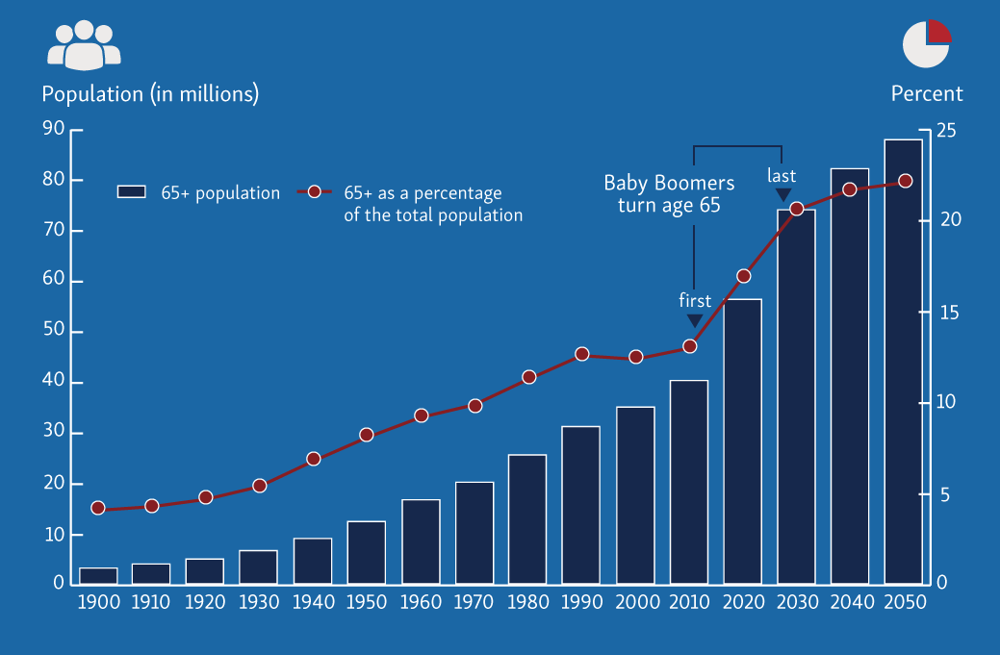

## Advancing Aging Research Through Technology

The aging population is growing and over the next few decades the world will see more people reach the age of 80 and 90 than ever before in human history.

{:target="_blank"}

With the rate of growth in the aging population research is advancing to meet the needs and demand.
This is both to fight diseases and disorders like Alzheimer's Disease, but it also means to observe how the aging process progresses and how to age successfully.
Aging people want research to focus on how to maintain independence and health though the whole lifespan.
